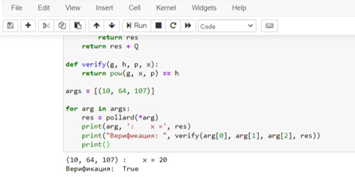

---
## Front matter
lang: ru-RU
title: Дискретное логарифмирование в конечном поле
author: Милёхин Александр НПМмд-02-21

## Formatting
mainfont: PT Serif
romanfont: PT Serif
sansfont: PT Sans
monofont: PT Mono
toc: false
slide_level: 2
theme: metropolis
header-includes: 
 - \metroset{progressbar=frametitle,sectionpage=progressbar,numbering=fraction}
 - '\makeatletter'
 - '\beamer@ignorenonframefalse'
 - '\makeatother'
aspectratio: 43
section-titles: true
---

## Цель лабораторной работы

Изучение задачи дискретного логарифмирования.

## Задача дискретного логарифмирования

Решение задачи дискретного логарифмирования состоит в нахождении некоторого целого неотрицательного числа $x$, удовлетворяющего уравнению. Если оно разрешимо, у него должно быть хотя бы одно натуральное решение, не превышающее порядок группы.

## p-алгоритм Полларда

* Вход. Простое число $p$, число $a$ порядка $r$ по модулю $p$, целое число $b$, $1 < b < p$; отображение $f$, обладающее сжимающими свойствами и сохраняющее вычислимость логарифма.
* Выход. показатель $x$, для которого $a^x=b(mod p)$, если такой показатель существует.

1. Выбрать произвольные целые числа $u, v$ и положить $c=a^u b^v (mod p), d=c$
2. Выполнять $c=f(c)(mod p), d=f(f(d))(mod p), вычисляя при этом логарифмы для $c$ и $d$ как линейные функции от $x$ по модулю $r$, до получения равенства $c=d (mod p)$
3. Приняв логарифмы для $c$ и $d$, вычислить логарифм $x$ решением сравнения по модулю $r$. Результат $x$ или "Решения нет".

## Оценка сложности

Алгоритм полного перебора нашёл бы решение за число шагов не выше порядка данной группы.

## Пример работы алгоритма

{ #fig:001 width=70% }

Получаем x = 20 для значений в данном примере.

## Результаты выполнения лабораторной работы

Я изучил задачу дискретного логарифмирования, повторил p-алгоритм Полларда, а также реализовал алгоритм программно на языке Python.

## Спасибо за внимание